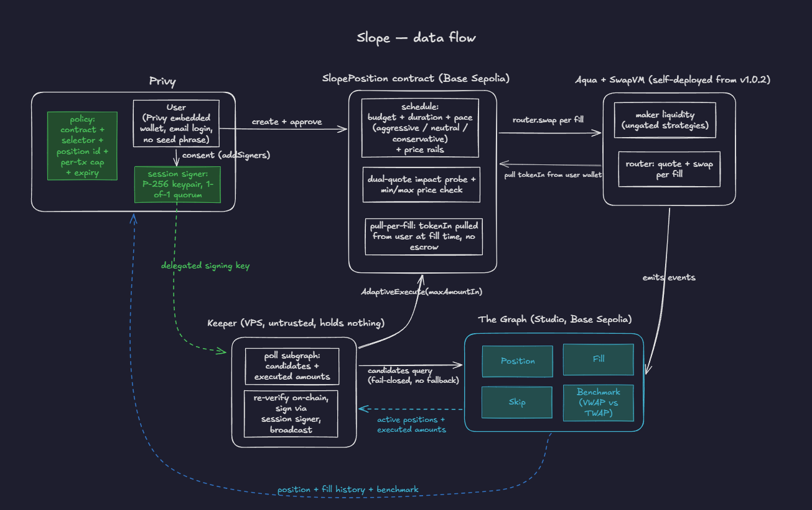
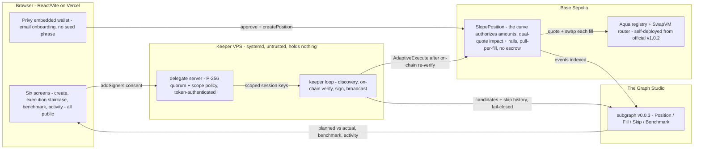
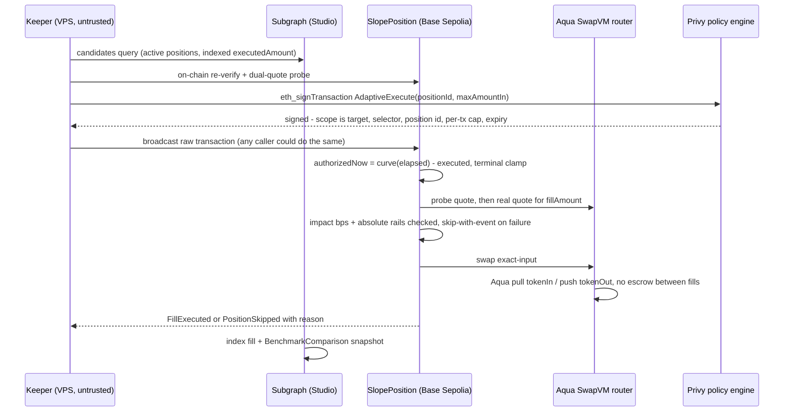

# Slope End-to-End Architecture

Status: **as-built**. Every brick below is implemented, deployed, and live on Base Sepolia; the Definition of Done at the end is observable today, item by item. The equations, skip semantics, and revision history remain normative in [`spec/SPEC.md`](spec/SPEC.md).

## 1. Product Boundary

Slope is a taker-side execution layer. A user publishes one self-authorizing execution policy:

- a fixed pair (`tokenIn`, `tokenOut`) and a `totalBudget` of tokenIn;
- a duration and a curve shape — AGGRESSIVE, NEUTRAL, or CONSERVATIVE — that schedules what fraction of the budget may have executed at each point in time;
- absolute price bounds `[minPrice, maxPrice]` and a per-fill price-impact limit `maxSlippageBps`;
- a `minFillAmount` floor that prevents micro-fills, bypassed only on final settlement;
- pull-per-fill custody: the contract pulls each fill's tokenIn from the owner's wallet at execution time and never holds funds between fills.

A keeper — or anyone, because execution is permissionless — triggers fills on schedule. Every fill is re-validated on-chain against the curve and settled through the official 1inch Aqua contracts. Every completed position is measured against a linear-TWAP benchmark on the same window and budget.

Computationally, each position is a **time-spread order**: unlike a limit order (bounded by price) or a plain TWAP (one implicit linear schedule), a Slope position carries an explicit, user-chosen schedule over time, and that schedule is the only thing that authorizes amounts.

Deliberate non-goals, unchanged in the shipped system:

- one curve family with hard-coded exponents rather than user-supplied code;
- no oracle dependency — price comes from dual quotes against the official Aqua router;
- no onchain scan over all positions;
- no protocol fee, no upgradeable proxy, no privileged administrator;
- no protocol custody vault — no escrow balance and no refund path;
- no in-place parameter editing — cancel and re-create;
- one pair (dETH/dUSD, 18/6 decimals) on Base Sepolia; no multichain story.

## 2. System Map

The whole system on one page (hand-drawn; the precise Mermaid map and the per-fill sequence follow):





## 3. Sources of Truth

The protocol must not treat one database as truth for every concern.

| Concern | Authoritative source | Consequence |
| --- | --- | --- |
| Actual tokenIn | Owner's ERC-20 balance and allowance | A failed `transferFrom` is a skip with a distinguishable event — never a revert; the keeper parks persistently failing positions. |
| Authorized amounts | `SlopePosition` storage + `CurveMath`, computed on-chain | The keeper's `maxAmountIn` is only an upper bound; the contract executes `min(authorizedNow, maxAmountIn)`. |
| Price and impact | `AquaSwapVMRouter.quote(...)` — probe + execution quotes, same transaction | No offchain price is ever trusted for an execution decision; both quotes are consistent by construction. |
| Settlement | Official Aqua registry + router, self-deployed from tag `v1.0.2` | All token movement flows through Aqua pull/push; no parallel custody layer exists. |
| Delegated signing | Privy policy engine, evaluated at signing time | Out-of-scope signer requests are rejected before broadcast; the on-chain contract remains authoritative regardless. |
| Discovery and history | Subgraph Studio index (live, API key) | Candidates and display only; indexing lag can cause a skip, never a bad fill. |
| Benchmark | Derived: indexed fills + `shared/` reference model | Snapshot as-of-last-fill in the mapping; live planned-vs-actual curves are computed in the frontend. |

Two consequences deserve emphasis. First, execution is **permissionless by design**: any caller produces the same state transition, so the product keeps liveness even if our keeper dies — the Privy policy and aggregation constrain only our delegated signer, never execution in general. Second, the Subgraph is a performance and visibility layer: a stale route wastes a cycle (logged as a skip), but cannot authorize a wrong amount, because amounts come only from the curve computed on-chain.

## 4. Canonical Identifiers And Data

### 4.1 Pair and price convention

Prices are tokenOut per one whole tokenIn, normalized to 18 decimals:

```text
price = (amountOut * 10^(18 - decimalsOut) * 1e18) / (amountIn * 10^(18 - decimalsIn))
```

Token decimals are read once at position creation and cached in the position (`decimalsIn`, `decimalsOut`). The identical formula exists in the TypeScript reference model; a committed vector asserts parity on the dETH(18)/dUSD(6) asymmetric case.

### 4.2 Position

`positionId` is a monotonically increasing `uint256` assigned by `SlopePosition` at creation. The exact event signatures, struct ABI, and any derived identifiers are frozen in `WIRE_FORMAT.md` at the Aqua-integration milestone. The stored policy is immutable after creation — there is no edit path, only cancel and re-create.

### 4.3 Fill record

Every successful fill emits `FillExecuted(positionId, amountIn, amountOut, executionPrice, timestamp)`; every skip emits a reason (`NOT_DUE`, `MIN_FILL`, `BOUNDS`, `IMPACT`, `QUOTE_INVALID`, `TRANSFER_FAILED`). Skips are first-class data: they are how the demo proves the guardrails are real.

### 4.4 Aqua-side strategy encoding

Demo liquidity is provisioned by seed wallets as Aqua makers: each ships an ungated SwapVM strategy (minimal `xycSwapXD` program — deliberately without the upstream KYC-gate opcode) via `Aqua.ship(app = router, strategy, [dETH, dUSD], amounts)`, with `traits = 1 << 254` marking an Aqua order. Total shipped stays ≤ the maker wallet's real balance — virtual balances are commitments, not escrow. The two roles are strictly separated: **seed wallets provide liquidity; user positions consume it over time as takers.** `SlopePosition` is the taker; it is never a maker.

## 5. Onchain Bricks

These are logical modules. Gas review may merge them, but responsibilities and tests remain separate.

### 5.1 `SlopeTypes.sol`

Canonical types: the `Position` struct (all fields per SPEC section 3, including `decimalsIn`/`decimalsOut` and `minFillAmount`), the `CurveShape` enum, all events (`PositionCreated`, `FillExecuted`, `PositionSkipped`, `PositionCompleted`), and custom errors. Distinguishes stored fixed-point prices (1e18 convention) from raw token amounts to prevent unit mixing.

Protocol dependency: none.

### 5.2 `CurveMath.sol`

Pure progress mathematics: `curveFunction(elapsed, duration, shape)` for the three fixed exponents (0.5 via a battle-tested sqrt from a pinned library — solmate `FixedPointMathLib` or PRBMath, never hand-rolled; 1 as plain division; 2 as plain multiplication), plus the terminal-clamp helper. Boundary conditions are exact and tested: `progress(0) = 0`, `progress(duration) = 1e18`.

Protocol dependency: none. Code dependency: pinned, permissively licensed fixed-point library, recorded with license in the provenance notes.

### 5.3 `PriceMath.sol`

The dual-quote impact measurement and the 18-decimal price normalization of section 4.1. Takes probe and execution quote results, returns normalized prices and `priceImpactBps`, and owns the rounding direction (impact measured against the reference price; conservative on comparisons).

Protocol dependency: none directly (operates on quote outputs).

### 5.4 `SlopePosition.sol`

Storage and the execution instruction. `createPosition(...)` validates parameters, caches decimals via `IERC20Metadata`, and emits `PositionCreated`. `AdaptiveExecute(uint256 positionId, uint256 maxAmountIn)` implements the ten-step flow of SPEC section 3: load and liveness check; elapsed; schedule with terminal clamp; `fillAmount = min(authorizedNow, maxAmountIn)` with the `minFillAmount` skip and final-settlement bypass; dual quotes through the router; impact and absolute-bounds checks (skip-with-event, never revert); `transferFrom` pull with skip-on-failure; `router.swap` exact-input settlement; `FillExecuted`; completion with dust handling. `cancel(positionId)` is owner-only and simply deactivates — with pull-per-fill custody there is nothing to refund.

The contract holds tokenIn only **inside** the atomic fill transaction (pulled from the owner, then spent by the router); between fills it holds nothing. Approvals: the user approves `SlopePosition` for ≥ `totalBudget`; `SlopePosition` approves the Aqua router for tokenIn spending.

Protocol dependency: official Aqua router via a minimal interface **written by us** — `SlopePosition` is independent calling code, carved out of the Degensoft licenses' copyleft; it stays MIT.

### 5.5 Aqua integration boundary

The Aqua registry ([`0xd2A8f6D7…64DA`](https://sepolia.basescan.org/address/0xd2A8f6D7645F53aB23dC3EcB146a196026F964DA#code)) and `AquaSwapVMRouter` ([`0x054F…7DA2`](https://sepolia.basescan.org/address/0x054F6A7CE03fdEB7814977B0FE7017cc5B2d7DA2#code)) are self-deployed to Base Sepolia from the official `v1.0.2` source (`via_ir`, cancun target) by our scripts — a redeployment the 1inch prize explicitly allows — and both are source-verified on the explorer. We never vendor their source; the `LICENSES/` directory preserves their license texts and third-party notices. A custom `_slopeXD` opcode ported from the unregistered `_twap` instruction remained a documented stretch goal and was deliberately not pursued in the shipped MVP; the baseline demo runs the official instruction set unchanged.

### 5.6 Demo scripts

Deploy the official registry + router, verify on the explorer where supported, seed ungated dETH/dUSD strategies from funded wallets (total shipped ≤ wallet balance), deploy `SlopePosition`, and write `deployments/84532.json` — the single manifest consumed by web, keeper, and subgraph config.

### 5.7 Seed strategy lifecycle

Seed strategies are discovered by their stored `strategyHash`es (Aqua does not enumerate strategies on-chain). Rebalancing means `dock` plus a fresh `ship` — immutable strategies, mutable inventory through dock-and-republish.

## 6. 1inch Integration

### 6.1 Aqua is load-bearing

| Aqua operation | Slope use |
| --- | --- |
| `ship(app, strategy, tokens, amounts)` | Seed wallets publish ungated dETH/dUSD strategies and virtual allocations. |
| `safeBalances(...)` | Available via `quote`/`swap` internals; execution requires active, sufficient allocation. |
| `pull(...)` / `push(...)` | Inside `router.swap`: releases tokenOut from the maker strategy and credits tokenIn to it — the fill settlement. |
| `dock(...)` | Retires a seed strategy. |
| `Shipped/Pushed/Pulled/Docked` | Subgraph context for seed liquidity; user-facing history keys off `SlopePosition` events. |

Tokens stay in the user's wallet until the moment of each fill; the user approves `SlopePosition`, not Aqua and not any vault. There is no protocol custody layer anywhere in the system.

### 6.2 SwapVM is load-bearing

Fills are executed through the official router's `quote`/`swap` pair — quote/swap consistency is the property that makes the dual-quote impact check meaningful, and it is tested explicitly. The taker blob is the minimal exact-in encoding; `shouldUnwrapWeth` stays false per Aqua constraints. If the custom `_slopeXD` opcode ships, the redeployed router preserves official validation and the Aqua settlement mode unchanged, and quote/swap parity is re-tested through the custom instruction.

Authoritative upstream references:

- Aqua contracts and documentation: https://github.com/1inch/aqua
- SwapVM contracts (pinned tag `v1.0.2`): https://github.com/1inch/swap-vm
- Aqua TypeScript SDK: https://github.com/1inch/sdks/tree/master/typescript/aqua
- Deployment template: https://github.com/1inch/swap-vm-template

## 7. TypeScript Bricks

### 7.1 `shared/curve`

The dependency-free reference model: identical progress formulas, identical price normalization, identical rounding direction. It powers the UI curve preview, the keeper's `authorizedNow` computation, and the cross-validation vectors — one implementation, three consumers. Committed vectors prove parity with Solidity, including the asymmetric-decimals case.

### 7.2 `shared/types`

Position, event, skip-reason, and configuration types shared by frontend and keeper, generated or hand-mirrored from the contract ABI with automated drift checks.

### 7.3 `shared/privy-policy`

The policy template builder (target allowlist, function restriction, per-transaction cap, expiry timestamp) shared by the consent flow and the keeper's expectations — so what the user approved is exactly what the keeper relies on.

## 8. Keeper Service

A single Node.js/TypeScript polling loop running under systemd on a public VPS (`keeper.endpx.cloud`, token-authenticated delegate API); poll interval configurable, 120 s in production. Per cycle, per active position:

1. read position state from the Subgraph (one indexed query, not per-position RPC scans);
2. compute `authorizedNow` from `shared/curve`;
3. if below `minFillAmount` (and not in the terminal window), skip this cycle cheaply;
4. re-verify price on-chain with the dual-quote check — the Subgraph is discovery, never the decision;
5. sign `AdaptiveExecute(positionId, maxAmountIn = authorizedNow)` via `@privy-io/node` (`eth_signTransaction`, the policy evaluated at signing) and self-broadcast the raw transaction;
6. log executed/skipped with the on-chain skip reason; park positions with persistent failures (e.g. revoked approval).

The keeper is untrusted and replaceable: it holds no user funds, and its `maxAmountIn` can only tighten what the curve already authorizes. Privy's policy constrains this signer's scope (target allowlist, function restriction, per-transaction cap, expiry); revocation happens in the UI. Cumulative spend aggregations were evaluated and deliberately left out of the signing path: an aggregation reference condition rejects every signing request regardless of operator or value format (established by bisecting a live policy), so rate limiting lives in the keeper and the budget invariant lives in the contract where it belongs.

## 9. The Graph Brick

### 9.1 `subgraph/`

Data sources are the `SlopePosition` events (`PositionCreated`, `FillExecuted`, `PositionSkipped`, `PositionCompleted`). Core entities:

| Entity | Purpose |
| --- | --- |
| `Position` | Full immutable policy, live `executedAmount`, active status. |
| `Fill` | Per-fill amounts, normalized execution price, timestamp; derived list per position. |
| `BenchmarkComparison` | As-of-last-fill snapshot: hypothetical linear-TWAP executed amount and VWAP vs. actual VWAP, computed in the mapping. |

Mappings run on events only — there is no "now" at query time, so `BenchmarkComparison` is an auditable snapshot and the frontend extrapolates live curves from position parameters plus fills (Decision 4 in SPEC). The keeper's discovery query filters active positions in one paginated dataset; `_meta.block` is recorded so stale snapshots are detected and handled as skips, not as truth.

The subgraph is deployed to Subgraph Studio on Base Sepolia and queried with an API key — live hosted data is a prize requirement, and no local Graph Node appears on the demo path.

## 10. Web Application Bricks

- **Wallet and network layer**: Privy embedded-wallet onboarding (email, no seed phrase) as the only path — external wallets are deliberately disabled in the modal because session signers can only control Privy-managed wallets; chain enforcement to Base Sepolia; deployment manifest resolution; no secrets beyond the rotatable Studio query key in the browser bundle.
- **Landing**: the pace ruler (all three schedules on one time axis) with a live indexed proof line and a real router quote.
- **Create**: the parameter matrix with the Canvas schedule preview drawn from `shared/curve` — what you see is what the contract computes — plus a live custody check and a deployment step machine (mint when inventory is short, approve when allowance is short, create, delegate) with per-stage failure states, retry from the failed step, auto-delegate, and redirect to the schedule's page.
- **Execution**: the planned-versus-actual ruler with an honest step path, fill and hold journal with tx links and per-fill deviation vs the TWAP benchmark, the Aqua protocol trace decoded with `@1inch/aqua-sdk`, remaining budget and time, delegation panel with revoke.
- **Portfolio**: wallet-scoped schedules plus live dETH and dUSD balances.
- **Performance**: benchmark overlay (actual VWAP vs. linear-TWAP VWAP) and per-position improvement summary, negatives included.
- **Activity**: the full indexed event stream with dates, block numbers, tx links, and CSV export.
- **Boot gate and awaiting-index states** that name what is actually loading instead of pretending.
- **Attribution footer**: "Powered by Aqua — © Degensoft Ltd 2025" and "Powered by SwapVM — © Degensoft Ltd 2025", per the licenses' README-and-UI requirement.

Dark theme, rounded elevated panels, live status indicator, monospace numerics; raw parameters behind advanced disclosure.

## 11. End-To-End Flows

### 11.1 Onboard and create a position

1. User logs in with email/social; Privy provisions the embedded wallet.
2. User configures the order; the preview is drawn from `shared/curve` — the same code path as the reference model.
3. User approves tokenIn to `SlopePosition` for ≥ `totalBudget` (permit-combined flow if the token supports it).
4. User submits; `createPosition` stores the immutable policy and emits `PositionCreated`.
5. The consent screen shows the exact policy scope and calls `addSigners` with the app's key-quorum signer and the policy id.
6. The Subgraph indexes the position; the keeper picks it up on the next cycle.

### 11.2 Keeper fill cycle

See section 8. The contract independently re-derives everything: even a hostile keeper can only pass a `maxAmountIn` smaller than the curve allows.



### 11.3 Inside `AdaptiveExecute`

The ten steps of SPEC section 3 are normative; the notable orderings are that quotes and impact checks happen **before** the `transferFrom` pull (so skips cost no transfers), and state commits happen only after settlement succeeds.

### 11.4 Revoke or cancel

- Cancel (owner): sets `isActive = false`; nothing to refund — unspent budget never left the wallet.
- Revoke (owner, UI): `removeSigners` removes the delegated authority.
- Approval revoke (owner, wallet): the next fill skips with `TRANSFER_FAILED`; the keeper parks the position. This is a feature — cutting the allowance is a hard stop with zero stranded funds.

### 11.5 Completion and benchmark

At or past the window's end, the terminal clamp authorizes the exact remainder regardless of `minFillAmount`; the final fill settles whenever it happens, `isActive` flips false, `PositionCompleted` fires once, and the dashboard renders the benchmark verdict: actual VWAP vs. the linear-TWAP VWAP on the same window and budget.

### 11.6 Seed liquidity lifecycle

Fund seed wallets from faucets → approve the Aqua registry → `ship` ungated strategies (total shipped ≤ balance) → optionally `dock` and re-`ship` to rebalance. Every seeded amount is recorded in the deployment manifest for demo reproducibility.

## 12. Security Bricks

### 12.1 Numerical safety

- Fixed exponents only; sqrt from a pinned, battle-tested library; no generic fixed-point pow; no swap-time iterative search.
- Boundary conditions tested exactly (`0 → 0`, `duration → 1e18`); fuzz asserts monotonic non-decreasing progress in `[0, 1e18]`.
- Decimal normalization in exactly one formula, mirrored in TypeScript, cross-validated on committed vectors.

### 12.2 Authorization safety

- The curve is the sole authority on amounts; `maxAmountIn` can only tighten it.
- Permissionless equivalence: any caller triggers the same state transition; there is no privileged keeper key on-chain.
- No admin path can alter a live position; cancel is owner-only and merely deactivates.
- The Privy session signer cannot touch owner funds outside `AdaptiveExecute` on `SlopePosition` — the policy allowlists exactly that target and function, with caps and expiry.

### 12.3 Custody safety

- Pull-per-fill: no escrow, no refund path, no in-flight balance between transactions.
- Approval revocation is a clean hard stop: skips, parks, zero stranded funds.
- The contract's token approvals are scoped (router, tokenIn) and sized to the fill, not open-ended treasury allowances.

### 12.4 Settlement safety

- Official Aqua path only; official router validation untouched in the baseline deployment.
- Quote/swap consistency asserted in tests (the property the impact check depends on).
- Skip semantics everywhere: no keeper-reachable path hard-reverts on routine conditions.
- Single-token flow per fill and no external callbacks into `SlopePosition` keep the reentrancy surface minimal; state commits only after settlement succeeds.

### 12.5 Delegated-execution safety

- Policy = target allowlist + function restriction + per-transaction cap + expiry.
- Cumulative spend aggregations were evaluated and deliberately removed from the signing path: an aggregation reference condition rejects every `eth_signTransaction` that contains one, established by bisecting a live policy. Rate limiting therefore lives in the keeper; the budget invariant lives in the contract (`executedAmount <= totalBudget`).
- Revocation is user-reachable in one click; expiry ends authority automatically.

### 12.6 Trust minimization

- Keeper: replaceable, untrusted, holds nothing.
- Subgraph: never a settlement input; staleness degrades to skips.
- No oracle; no admin; no protocol fee; deployment addresses and the pinned upstream commit published in the manifest.

## 13. Verification Bricks

| Layer | Required verification |
| --- | --- |
| Math | Boundary vectors (0 → 0, duration → exactly 1e18) per shape; monotonicity and range fuzz; rounding-direction tests. |
| Differential | Solidity vs. `shared/` reference model on committed vectors, including WETH(18)/USDC(6). |
| Execution | Full skip matrix (bounds, impact, min-fill, expiry, not-due), `maxAmountIn` tightening, pull-failure skips, completion and dust, terminal clamp with sub-minimum settlement. |
| Integration | Scripted Base Sepolia run: real `ship`, real `quote`/`swap` through the deployed official router, real ERC-20 transfers — no mocked success values. |
| Delegated | Out-of-scope signer request rejected by Privy; in-scope passes; aggregation headroom behavior; revoke ends authority. |
| Subgraph | Event-to-entity mapping tests; `executedAmount` continuity; benchmark snapshot correctness against the reference model. |
| Web | Onboard → create → fills → completion → benchmark on the hosted URL; wrong-network and rejected-transaction handling; revoke path. |

## 14. Deployment And Operations Bricks

### 14.1 Dependency pinning gate

Before importing any code: pin Aqua/SwapVM to tag `v1.0.2` (never `main`), pin SDK versions (`@1inch/aqua-sdk`, `@1inch/swap-vm-sdk`, `@privy-io/node`, viem), record them with licenses in the research notes, and preserve upstream notices in `LICENSES/`. No moving branch is a deployment dependency.

### 14.2 Network profile

One profile, decided deliberately (SPEC Decision 1): Base Sepolia with the official contracts self-deployed from source — keeping subgraph, keeper, Privy, and demo on one consistent, publicly explorable chain. A Base mainnet fork remains a test-only fallback; local forks never serve the canonical demo (zero-localhost gate).

### 14.3 Deployment manifest

`deployments/84532.json` records chain id, deployment block, pinned upstream commit, Aqua registry and router addresses, `SlopePosition` address, seed strategy hashes, the Subgraph deployment URL and version, and explorer metadata. Web, keeper, and subgraph config all consume this one schema.

### 14.4 Runtime operations

- Keeper interval configurable (the VPS keeper runs at 120 s, about 720 queries/day against the 3,000/day Studio bucket); skip-reason logs retained in journald for the demo narrative.
- The delegate API carries a shared-secret token whenever it is exposed beyond localhost; see SECURITY.md.
- Demo reset script: re-seed liquidity, re-fund wallets, redeploy or reuse `SlopePosition` per manifest.
- RPC fallback endpoints configured; attribution footer present; no private key, API key, or sponsor credential ever committed.

## 15. Sponsor Mapping

| Sponsor | Actual product brick | Why it is meaningful |
| --- | --- | --- |
| 1inch Aqua | Seed strategy publication, virtual allocation, and the entire fill settlement path (`pull`/`push` through the official router) | Slope cannot settle a single fill without Aqua; custody stays with the user and the maker at all times. |
| 1inch SwapVM | The official `quote`/`swap` execution pair with bytecode strategies; the stretch `_slopeXD` opcode extends the instruction set itself | Execution runs through the deployed VM, not a cosmetic API call; quote/swap consistency is load-bearing for the impact check. |
| The Graph | Live position discovery for the keeper, fill history for the UI, benchmark snapshots computed in the mapping | One indexed dataset replaces per-position RPC scans and makes automated schedule-following operationally real; all data is live Studio data behind an API key. |
| Privy | Embedded-wallet onboarding and bounded delegation (policy-scoped session signer evaluated at signing) | The user never manages a seed phrase and never hands over funds; the delegation boundary is enforced by infrastructure, with the contract as the authoritative second layer. |

No fourth partner; no MCP server (the qualification narrative for The Graph is the keeper's automated work over live data, documented explicitly in the README).

## 16. Workspace Target

```text
contracts/
  src/math/        CurveMath, PriceMath (pure; pinned fixed-point deps)
  src/core/        SlopeTypes, SlopePosition
  src/interfaces/  minimal Aqua router interface (authored by us)
  script/          deploy official Aqua, seed strategies, deploy + verify SlopePosition, manifest
  test/            unit, fuzz, differential-vector, and Sepolia integration tests
frontend/          React + Vite app (six screens, Canvas charts, Privy onboarding)
keeper/            polling loop, verification pipeline, Privy signing, logging
subgraph/          schema, AssemblyScript mappings, Studio deployment config
shared/            curve reference model, shared types, policy template builder
deployments/       84532.json manifest
docs/              spec, plans, architecture, wire format, runbooks
submission/        cover, logo, and live screenshots for the ETHGlobal form
prompts/           material AI-assisted development artifacts
```

## 17. Implementation Order And Gates

The file-by-file sequence, tests, and intended commits are normative in [`IMPLEMENTATION_ORDER.md`](IMPLEMENTATION_ORDER.md). Architecture-level summary:

1. **Pin and prove dependencies** — official Aqua deployed on Base Sepolia and one real seeded strategy before any UI.
2. **Freeze the math** — pure curve kernel with boundary, fuzz, and differential tests.
3. **Freeze storage** — position creation and the immutable policy.
4. **Prove one execution** — `AdaptiveExecute` against mock adapters with the full skip matrix.
5. **Prove all shapes** — AGGRESSIVE/CONSERVATIVE plus reference-model parity vectors.
6. **Prove real settlement** — the same execution through the deployed official router on-chain.
7. **Prove delegation** — Privy onboarding, policy enforcement, sign-and-broadcast end to end.
8. **Ship live data** — Subgraph on Studio; keeper discovery depends on it.
9. **Ship the product UI** — the six-screen application on the hosted URL.
10. **Harden and rehearse** — demo reset, two full rehearsals, submission package.

No later brick may compensate for a failed earlier gate: the UI, the subgraph, or sponsor tooling cannot make an unverified curve or a broken settlement safe. All ten gates closed between 5 and 12 September 2026.

## 18. MVP Definition Of Done

The shipped product satisfies this complete sequence with real contract calls. Each item is observable today:

1. a fresh browser reaches the hosted app and onboards with an embedded wallet — no seed phrase, no extension required;
2. the user creates a position whose on-screen curve is the curve the contract enforces;
3. fills land on that curve over time, each with an explorer-linked transaction showing a real Aqua settlement;
4. at least one skip is demonstrated (bounds or min-fill) with its reason surfaced — the guardrails are visible, not claimed;
5. the position completes via the terminal clamp and the benchmark verdict (actual VWAP vs. linear TWAP) is rendered;
6. a live Subgraph Studio query shows the position and fills with API-key-authenticated, non-local data;
7. an out-of-scope signer request is rejected by the Privy policy, and revoke cleanly ends delegated authority;
8. the full test suite passes from a fresh clone.

Schedules #12 and #13 demonstrate the complete sequence end to end, and the three FEEDBACK documents at the repository root record the sponsor-integration findings encountered on the way, together with the sponsor issues they produced.
